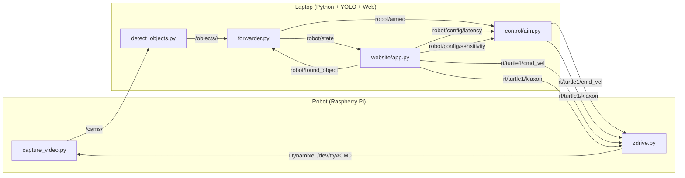

# 🍌 Banane v2.0

> Robot autonome piloté par Zenoh : la Raspberry Pi capture les images, le
> laptop détecte les objets avec YOLO, et le robot va les chercher tout seul.

[](https://www.python.org/)
[](https://zenoh.io/)
[](https://github.com/ultralytics/ultralytics)
[](LICENSE)

---

## À propos

**Banane v2.0** est un projet de **semaine d'intégration à CentraleSupélec**.
En quelques jours, des étudiants ont conçu un robot capable de repérer un
objet cible dans une pièce à l'aide d'une caméra et d'un modèle de
détection d'objets, puis de s'en approcher en autonomie. La liaison entre
le robot (Raspberry Pi + caméra + servomoteur Dynamixel) et le poste de
contrôle (laptop + interface web) repose intégralement sur **[Zenoh](https://zenoh.io/)**,
un middleware pub/sub pensé pour les systèmes distribués et les flots de
données à haut débit.

Le projet a été conçu pour illustrer deux enjeux pédagogiques :

1. **Construire un pipeline temps réel** qui traverse des processus Python
   distincts, des équipements hétérogènes (CPU embarqué + GPU laptop), et un
   médium peu fiable (Wi-Fi).
2. **Découpler les responsabilités** entre capture, détection, navigation et
   interface homme-machine grâce à un bus de messages partagé, plutôt qu'à
   des appels de fonctions enchaînés.


L'interface web ci-dessus est la station de contrôle : elle affiche le
flux caméra annoté, permet de pousser un nouvel objectif dans la file
d'attente, et expose les deux paramètres de la boucle d'aim (latence et
sensibilité angulaire).

## Architecture

Le système est réparti entre deux machines qui communiquent par Zenoh :



### Topics Zenoh

| Sens | Topic | Payload | Producteur(s) | Consommateur(s) |
|---|---|---|---|---|
| Frames caméra | `demo/obj-detect/cams/<cam_id>` | JPEG bytes | `capture_video.py` | `detect_objects.py`, `web_display_video.py`, `display_video.py` |
| Détections YOLO | `demo/obj-detect/objects/<cam>/<i>` | JSON `{name, confiance, box, …}` | `detect_objects.py` | `forwarder.py`, `web_display_video.py`, `display_video.py` |
| Détection ciblée | `robot/aimed` | JSON (mêmes clés) | `forwarder.py` | `control/aim.py`, `website/app.py` |
| État robot | `robot/state` | 1 byte (`bool`) | `forwarder.py` | `control/aim.py` |
| Cible atteinte | `robot/found_object` | UTF-8 (nom) | `control/aim.py` | `forwarder.py`, `website/app.py` |
| Latence aim | `robot/config/latency` | UTF-8 (ms) | `website/app.py` | `control/aim.py` |
| Sensibilité aim | `robot/config/sensitivity` | UTF-8 (deg/step) | `website/app.py` | `control/aim.py` |
| Commande vitesse | `rt/turtle1/cmd_vel` | CDR `Twist` | `control/aim.py`, `control/web_teleop.py` | `motor/zdrive.py` |
| Klaxon | `rt/turtle1/klaxon` | UTF-8 (sound ID) | `control/aim.py`, `control/web_teleop.py` | `motor/zdrive.py` |
| Heartbeat | `rt/turtle1/heartbeat` | UTF-8 (counter) | `motor/zdrive.py` | outils de diagnostic |

## Structure du dépôt

```
Autonomus-robot-zenoh/
├── README.md
├── LICENSE                            ← MIT
├── requirements.txt
├── docs/
│   └── screenshots/
│       └── dashboard.png
├── models/                            ← modèles YOLO (non versionnés)
├── src/
│   ├── common/                        ← helpers partagés (types CDR, topics, argparse, publishers)
│   │   ├── types.py
│   │   ├── topics.py
│   │   ├── zenoh_args.py
│   │   └── publish.py
│   ├── video/
│   │   ├── capture_video.py           ← capture + publication JPEG sur Zenoh (Pi ou USB)
│   │   ├── detect_objects.py          ← YOLO sur les frames reçues
│   │   ├── display_video.py           ← viewer OpenCV (debug)
│   │   ├── web_display_video.py       ← générateur MJPEG pour la webapp
│   │   └── forwarder.py               ← filtre les détections et publie robot/aimed
│   ├── control/
│   │   ├── aimstate.py                ← enum STOPPED / SEARCHING / AIMING / ADVANCING
│   │   ├── aim.py                     ← machine d'état et génération des Twist
│   │   ├── teleop.py                  ← téléop clavier curses
│   │   ├── web_teleop.py              ← téléop HTTP appelé par la webapp
│   │   └── common.py                  ← shim rétro-compatible (ré-exporte common.types)
│   ├── motor/
│   │   ├── servo.py                   ← constantes + wrapper bas niveau Dynamixel
│   │   └── zdrive.py                  ← bridge Zenoh → servomoteur
│   └── launch/
│       └── pi.bash                    ← script de démarrage côté Pi
├── website/
│   ├── app.py                         ← FastAPI (MJPEG, SSE, REST)
│   ├── templates/
│   │   └── index.html                 ← UI Tailwind dark mode
│   └── scripts/
│       └── script.js
├── detection_banana/                  ← variante mono-classe (détection de bananes uniquement)
│   ├── detector.py
│   └── publisher.py
└── test.py                            ← mock publisher pour tester la chaîne sans caméra
```

## Stack technique

### Logiciel

- **Python 3.10+**
- **[Zenoh](https://zenoh.io/)** — middleware pub/sub
- **[Ultralytics YOLO](https://github.com/ultralytics/ultralytics)** — détection d'objets
- **OpenCV** + **imutils** — capture et annotations vidéo
- **FastAPI** + **Uvicorn** — tableau de bord web
- **pycdr2** — sérialisation CDR des messages `Twist`/`Vector3`
- **dynamixel-sdk** — protocole série du servomoteur
- **Tailwind CSS** — interface web

### Matériel

- Raspberry Pi 4 (Wi-Fi)
- Module caméra Raspberry Pi (`picamera2`) ou webcam USB
- Servomoteur Dynamixel (XM430) + carte de contrôle
- Alimentation + châssis mobile

## Installation

```bash
git clone https://github.com/<ton-compte>/Autonomus-robot-zenoh.git
cd Autonomus-robot-zenoh

python -m venv .venv
source .venv/bin/activate

pip install -r requirements.txt
# Sur Raspberry Pi OS uniquement :
sudo apt install -y python3-picamera2
```

Le modèle YOLO n'est pas versionné dans le dépôt. Téléchargez-le
explicitement dans `models/` (Ultralytics le fait à la volée au premier
lancement, mais le pré-télécharger accélère les redémarrages) :

```bash
mkdir -p models
# Option 1 : laisser Ultralytics gérer (recommandé)
python -c "from ultralytics import YOLO; YOLO('models/yolo26s.pt')"
```

## Lancement

Trois fenêtres / processus distincts, plus un routeur Zenoh optionnel :

### 1. (Optionnel) Routeur Zenoh sur un PC fixe

```bash
zenoh-router
```

Utile si le Pi et le laptop ne se voient pas directement en multicast, ou
pour observer le trafic via `zenoh-inspector`.

### 2. Côté Raspberry Pi

```bash
cd src/
bash launch/pi.bash <IP_DU_LAPTOP>
```

`<IP_DU_LAPTOP>` est l'IP du PC qui fait tourner `detect_objects.py` et la
webapp — c'est l'endpoint Zenoh auquel le Pi va se connecter (`tcp/<IP>:7447`).
Le script lance `capture_video.py`, `zdrive.py` et `aim.py` en parallèle.

### 3. Côté laptop

```bash
# Détection YOLO + forwarder
python src/video/detect_objects.py
python src/video/forwarder.py &        # ou via website/app.py

# Dashboard web
uvicorn website.app:app --host 0.0.0.0 --port 8000
```

Le dashboard est alors accessible sur <http://localhost:8000>.

## Utilisation

1. **Sélectionner un objectif** via les boutons « Cibles » ou en le
   tapant dans la console en bas de la page.
2. Le robot se met en mode `SEARCHING` (rotation lente) tant qu'il ne
   détecte rien.
3. Quand l'objet ciblé apparaît dans le champ de la caméra, il passe en
   `AIMING` puis en `ADVANCING` jusqu'à atteindre la taille d'arrêt
   (`HEIGHT_STOP_SIZE` / `WIDTH_STOP_SIZE` dans `control/aim.py`).
4. À l'arrêt, le klaxon retentit et l'objectif passe en vert dans la file
   d'attente.
5. Les sliders **Latence** et **Échelle angulaire** ajustent en direct
   la réactivité de la boucle d'aim.

## Crédits

Projet réalisé par des étudiants de **CentraleSupélec** dans le cadre
d'une semaine d'intégration.

- **[ZettaScale](https://zettascale.tech/)** pour [Zenoh](https://zenoh.io/),
  middleware utilisé pour tout le bus de messages.
- **[Ultralytics](https://github.com/ultralytics/ultralytics)** pour
  YOLO, le modèle de détection d'objets.
- Le script de téléop clavier (`src/control/teleop.py`) est adapté d'un
  exemple de la [zenoh-bridge-ros2dds](https://github.com/eclipse-zenoh/zenoh-bridge-ros2dds)
  (licence Apache-2.0 / EPL-2.0).

## Licence

[MIT](LICENSE) — voir le fichier `LICENSE` à la racine.
