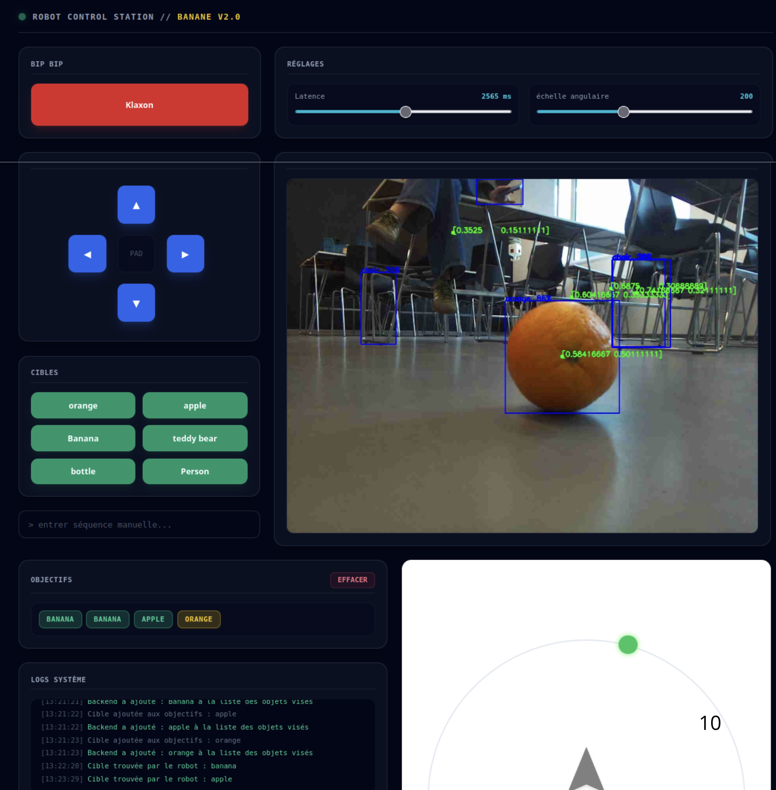
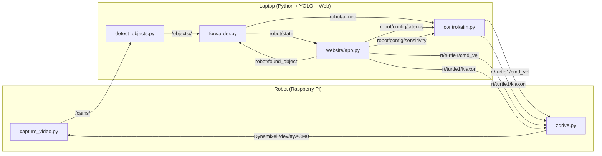

# 🤖 Autonomous Robot

> An autonomous robot powered by Zenoh: the Raspberry Pi captures images, the
> laptop detects objects with YOLO, and the robot goes after them on its own.

[](https://www.python.org/)
[](https://zenoh.io/)
[](https://github.com/ultralytics/ultralytics)
[](LICENSE)

---

## About

**Autonomous Robot** is a project developed during the **CentraleSupélec integration week**.
In just a few days, students designed a robot capable of spotting a target
object in a room using a camera and an object-detection model, then getting
closer to it autonomously. The link between the robot (Raspberry Pi + camera +
Dynamixel servo) and the control station (laptop + web interface) is based
entirely on **[Zenoh](https://zenoh.io/)**, a pub/sub middleware designed for
distributed systems and high-throughput data streams.

The project was designed to illustrate two educational challenges:

1. **Build a real-time pipeline** that spans multiple Python processes,
   heterogeneous equipment (embedded CPU + laptop GPU), and an unreliable
   medium (Wi-Fi).
2. **Decouple responsibilities** between capture, detection, navigation, and
   the human-machine interface through a shared message bus rather than a chain
   of coupled function calls.



The web interface above is the control station: it displays the annotated camera
feed, lets you push a new target into the queue, and exposes the two parameters
of the aim loop (latency and angular sensitivity).

## Architecture

The system is split across two machines that communicate over Zenoh:



### Zenoh topics

| Direction | Topic | Payload | Producer(s) | Consumer(s) |
|---|---|---|---|---|
| Camera frames | `demo/obj-detect/cams/<cam_id>` | JPEG bytes | `capture_video.py` | `detect_objects.py`, `web_display_video.py`, `display_video.py` |
| YOLO detections | `demo/obj-detect/objects/<cam>/<i>` | JSON `{name, confidence, box, …}` | `detect_objects.py` | `forwarder.py`, `web_display_video.py`, `display_video.py` |
| Targeted detection | `robot/aimed` | JSON (same keys) | `forwarder.py` | `control/aim.py`, `website/app.py` |
| Robot state | `robot/state` | 1 byte (`bool`) | `forwarder.py` | `control/aim.py` |
| Target reached | `robot/found_object` | UTF-8 (name) | `control/aim.py` | `forwarder.py`, `website/app.py` |
| Aim latency | `robot/config/latency` | UTF-8 (ms) | `website/app.py` | `control/aim.py` |
| Aim sensitivity | `robot/config/sensitivity` | UTF-8 (deg/step) | `website/app.py` | `control/aim.py` |
| Velocity command | `rt/turtle1/cmd_vel` | CDR `Twist` | `control/aim.py`, `control/web_teleop.py` | `motor/zdrive.py` |
| Klaxon | `rt/turtle1/klaxon` | UTF-8 (sound ID) | `control/aim.py`, `control/web_teleop.py` | `motor/zdrive.py` |
| Heartbeat | `rt/turtle1/heartbeat` | UTF-8 (counter) | `motor/zdrive.py` | diagnostic tools |

## Repository structure

```
autonomous-robot/
├── README.md
├── LICENSE                            ← MIT
├── requirements.txt
├── docs/
│   └── screenshots/
│       └── dashboard.png
├── models/                            ← YOLO models (not versioned)
├── src/
│   ├── common/                        ← shared helpers (CDR types, topics, argparse, publishers)
│   │   ├── types.py
│   │   ├── topics.py
│   │   ├── zenoh_args.py
│   │   └── publish.py
│   ├── video/
│   │   ├── capture_video.py           ← capture + JPEG publication over Zenoh (Pi or USB)
│   │   ├── detect_objects.py          ← YOLO on received frames
│   │   ├── display_video.py           ← OpenCV viewer (debug)
│   │   ├── web_display_video.py       ← MJPEG generator for the web app
│   │   └── forwarder.py               ← filters detections and publishes robot/aimed
│   ├── control/
│   │   ├── aimstate.py                ← STOPPED / SEARCHING / AIMING / ADVANCING enum
│   │   ├── aim.py                     ← state machine and Twist generation
│   │   ├── teleop.py                  ← keyboard teleop (curses)
│   │   ├── web_teleop.py              ← HTTP teleop invoked by the web app
│   │   └── common.py                  ← backward-compatible shim (re-exports common.types)
│   ├── motor/
│   │   ├── servo.py                   ← constants + low-level Dynamixel wrapper
│   │   └── zdrive.py                  ← Zenoh → motor bridge
│   └── launch/
│       └── pi.bash                    ← startup script for the Pi side
├── website/
│   ├── app.py                         ← FastAPI (MJPEG, SSE, REST)
│   ├── templates/
│   │   └── index.html                 ← dark mode Tailwind UI
│   └── scripts/
│       └── script.js
├── detection_banana/                  ← single-class variant (banana detection only)
│   ├── detector.py
│   └── publisher.py
└── test.py                            ← mock publisher for testing the pipeline without a camera
```

## Tech stack

### Software

- **Python 3.10+**
- **[Zenoh](https://zenoh.io/)** — pub/sub middleware
- **[Ultralytics YOLO](https://github.com/ultralytics/ultralytics)** — object detection
- **OpenCV** + **imutils** — video capture and annotation
- **FastAPI** + **Uvicorn** — web dashboard
- **pycdr2** — CDR serialization for `Twist`/`Vector3` messages
- **dynamixel-sdk** — serial protocol for the servo motor
- **Tailwind CSS** — web UI styling

### Hardware

- Raspberry Pi 4 (Wi-Fi)
- Raspberry Pi camera module (`picamera2`) or USB webcam
- Dynamixel servo (XM430) + control board
- Power supply + mobile chassis

## Installation

```bash
git clone https://github.com/<your-account>/autonomous-robot.git
cd autonomous-robot

python -m venv .venv
source .venv/bin/activate

pip install -r requirements.txt
# On Raspberry Pi OS only:
sudo apt install -y python3-picamera2
```

The YOLO model is not versioned in the repository. Download it explicitly into
`models/` (Ultralytics does this on first run, but pre-downloading speeds up
restart times):

```bash
mkdir -p models
# Option 1: let Ultralytics manage it (recommended)
python -c "from ultralytics import YOLO; YOLO('models/yolo26s.pt')"
```

## Launch

Three separate windows / processes, plus an optional Zenoh router:

### 1. (Optional) Zenoh router on a fixed PC

```bash
zenoh-router
```

Useful if the Pi and laptop are not directly visible via multicast, or to
observe traffic with `zenoh-inspector`.

### 2. On the Raspberry Pi side

```bash
cd src/
bash launch/pi.bash <LAPTOP_IP>
```

`<LAPTOP_IP>` is the IP of the PC running `detect_objects.py` and the web app —
it is the Zenoh endpoint the Pi connects to (`tcp/<IP>:7447`).
The script launches `capture_video.py`, `zdrive.py`, and `aim.py` in parallel.

### 3. On the laptop side

```bash
# YOLO detection + forwarder
python src/video/detect_objects.py
python src/video/forwarder.py &        # or via website/app.py

# Web dashboard
uvicorn website.app:app --host 0.0.0.0 --port 8000
```

The dashboard is then available at <http://localhost:8000>.

## Usage

1. **Select a target** via the “Targets” buttons or by typing it in the console
   at the bottom of the page.
2. The robot enters `SEARCHING` mode (slow rotation) until it detects anything.
3. When the target object appears in the camera frame, it moves into `AIMING`
   and then `ADVANCING` until it reaches the stop size
   (`HEIGHT_STOP_SIZE` / `WIDTH_STOP_SIZE` in `control/aim.py`).
4. At rest, the klaxon sounds and the target turns green in the queue.
5. The **Latency** and **Angular scale** sliders adjust the responsiveness of the
   aim loop in real time.

## Credits

Project developed by students at **CentraleSupélec** as part of an
integration week.

- **[ZettaScale](https://zettascale.tech/)** for [Zenoh](https://zenoh.io/),
  the middleware used for the message bus.
- **[Ultralytics](https://github.com/ultralytics/ultralytics)** for YOLO,
  the object-detection model.
- The keyboard teleop script (`src/control/teleop.py`) is adapted from an
  example in [zenoh-bridge-ros2dds](https://github.com/eclipse-zenoh/zenoh-bridge-ros2dds)
  (Apache-2.0 / EPL-2.0 license).

## License

[MIT](LICENSE) — see the `LICENSE` file at the repository root.
